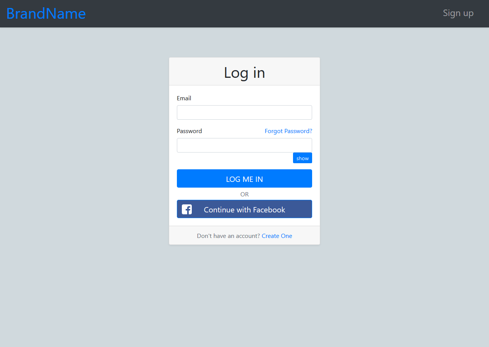

# Bootstrap Your Forms

Fully Mobile Responsive Beautiful Forms with Bootstrap 4

  

## Installation

Let's make it easy! Just download this template, use it on your project.

## Tech Stack

- HTML
- CSS
- Bootstrap

## Demo

- [Home](https://bootstrap-your-forms.surge.sh/)
- [Login](https://bootstrap-your-forms.surge.sh/pages/login.html)
- [Register](https://bootstrap-your-forms.surge.sh/pages/signup.html)
- [Reset Password](https://bootstrap-your-forms.surge.sh/pages/reset-password.html)
- [Email Verification](https://bootstrap-your-forms.surge.sh/pages/verify.html)

## License

This is an open source Template [licensed as MIT](https://github.com/safdarjamal/bootstrap-your-forms/blob/master/LICENSE).
